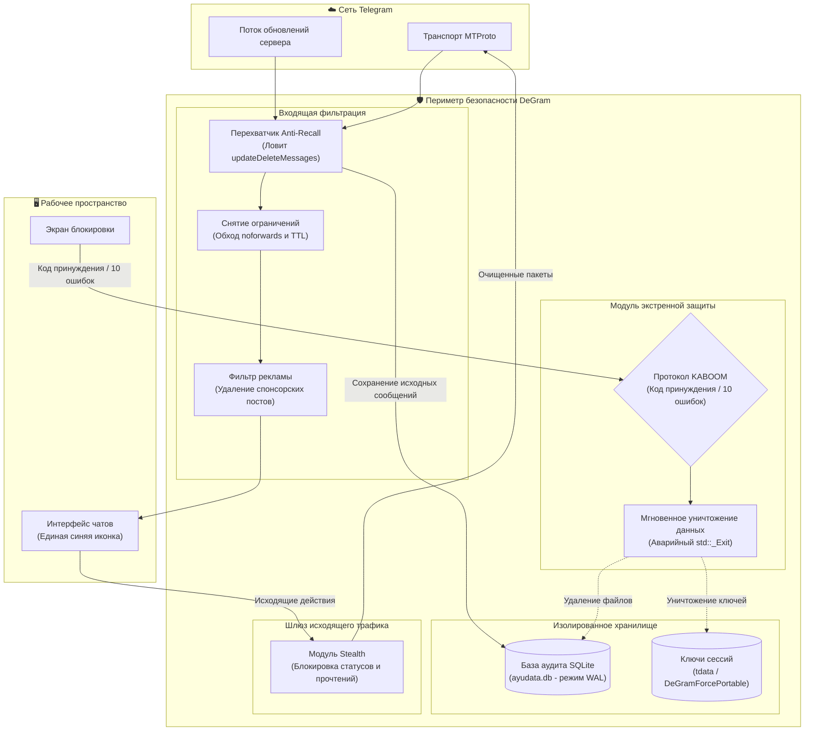

<div align="center">


# DeGram Desktop
### Портативный клиент Telegram корпоративного уровня с защитой приватности

[](https://github.com/intelQong/DeGram/releases)
[](LICENSE)
[%20%7C%20Windows%20%7C%20macOS-informational?style=flat-square)](#-матрица-портативного-развертывания)
[](#-инфраструктура-сборки)
[-success?style=flat-square)](#-архитектура-безопасности)
[](https://github.com/intelQong/DeGram/actions)

[English](README.md) · [Русский](README-RU.md) · [Загрузка пакетов](#-матрица-портативного-развертывания) · [Архитектура безопасности](#-архитектура-безопасности) · [Функционал](#-ключевые-возможности) · [Сборка](#-инфраструктура-сборки) · [Лицензирование](#-лицензия-и-управление)

</div>

---

## 🏛️ Концепция проекта

**DeGram Desktop** — это автономный, полностью портативный и защищенный клиент на базе Telegram Desktop, созданный для профессионалов, аналитиков, исследователей и организаций, предъявляющих повышенные требования к конфиденциальности и контролю над данными.

Обычные клиенты обмена сообщениями предоставляют удаленным серверам и собеседникам полный контроль над вашими локальными данными: сообщения могут быть удалены или изменены без вашего ведома, следы активности сохраняются в реестре и системных каталогах, а фоновые службы собирают телеметрию.

DeGram восстанавливает **полный суверенитет пользователя над данными**:
1. **Неизменяемое локальное хранение истории**: Удаленные и отредактированные сообщения навсегда сохраняются в локальной зашифрованной базе данных SQLite с полными метками времени.
2. **Экстренное уничтожение данных (протокол KABOOM)**: Поддержка кода принуждения и защита от подбора пароля — полное удаление сессионных ключей и баз данных за миллисекунды.
3. **100% изоляция и портативность**: Отсутствие записей в реестре и системных папках хоста. Запуск с любых внешних накопителей (USB) на Linux (x86_64 и ARM64), Windows и macOS.
4. **Полное отсутствие телеметрии**: Отключена отправка аналитики, метрик и журналов сбоев на сторонние серверы.

---

## 🛡️ Ключевые возможности

### 🗄️ Сохранение сообщений и истории правок (Anti-Recall)
* **Перехват удаления**: Сообщения, удаленные собеседниками или администраторами, перехватываются на уровне MTProto и сохраняются в локальной SQLite базе (`ayudata.db`).
* **Визуальный аудит**: Удаленные сообщения помечаются специальным индикатором (`🧹`), а для измененных сообщений доступна полная история всех правок.
* **Гибкие политики**: Настройка сохранения для личных чатов, групп, каналов или глобально.

### 💥 Код принуждения и экстренная очистка («KABOOM»)
* **Пароль под принуждением**: Ввод специального кода на экране блокировки мгновенно выполняет рекурсивное удаление всех ключей авторизации, сессий и локальных баз данных, после чего принудительно завершает процесс (`std::_Exit(0)`).
* **Защита от физического взлома**: Превышение 10 неверных попыток ввода пароля блокировки автоматически активирует протокол KABOOM.
* **Кнопка «Убить приложение»**: Специальный пункт в главном боковом меню для немедленного аварийного закрытия приложения без фоновых процессов.

### 👁️ Режим невидимки (Ghost Protocol)
* **Скрытие прочтения**: Просматривайте сообщения в личных диалогах, группах и каналах без отправки уведомления о прочтении (`ReadHistory`).
* **Скрытие набора текста и статуса**: Отключение индикатора набора текста, записи медиа и статуса «в сети».
* **Анонимный просмотр историй**: Просмотр историй пользователей без фиксации вашего аккаунта в списке просмотров.

### 🔓 Обход ограничений и DRM
* **Снятие защиты от сохранения**: Сохраняйте фото, видео и пересылайте сообщения из каналов и чатов с включенными ограничениями (`noforwards`, `restrict_saving_content`).
* **Сохранение самоуничтожающихся медиа (TTL)**: Одноразовые фото и видео не исчезают по таймеру и остаются доступными до явного закрытия.

### 🏢 Корпоративные функции
* **До 100 аккаунтов одновременно**: Поддержка до 100 учетных записей в одном приложении с мгновенным переключением.
* **Режим презентаций (Streamer Mode)**: Скрытие номеров телефонов, идентификаторов пользователей и текста входящих уведомлений при демонстрации экрана.
* **Блокировка рекламы**: Вырезание спонсорских сообщений и рекламных постов в каналах до отрисовки интерфейса.

---

## 🔬 Архитектура безопасности



---

## 📦 Матрица портативного развертывания

DeGram Desktop распространяется в виде готовых портативных пакетов для всех основных платформ:

| Платформа | Архитектура | Пакет | Размер | Контрольная сумма |
| :--- | :--- | :--- | :--- | :--- |
| **Linux** | `x86_64` (AMD64) | [`DeGram-Portable-7.0.20-x86_64.tar.xz`](https://github.com/intelQong/DeGram/releases) | ~96 МБ | [SHA256](https://github.com/intelQong/DeGram/releases) |
| **Linux** | `aarch64` (ARM64) | [`DeGram-Portable-7.0.20-arm64.tar.xz`](https://github.com/intelQong/DeGram/releases) | ~69 МБ | [SHA256](https://github.com/intelQong/DeGram/releases) |
| **Windows** | `x86_64` (64-бит) | [`DeGram-Portable-7.0.20-Windows-x64.zip`](https://github.com/intelQong/DeGram/releases) | Портативный `.zip` | [SHA256](https://github.com/intelQong/DeGram/releases) |
| **macOS** | Universal (`arm64` / `x86_64`) | [`DeGram-Portable-7.0.20-macOS.zip`](https://github.com/intelQong/DeGram/releases) | Автономный `.app` | [SHA256](https://github.com/intelQong/DeGram/releases) |

### Инструкции по установке и запуску

#### 🐧 Linux (x86_64 и ARM64)
```bash
# 1. Проверка контрольной суммы
sha256sum -c DeGram-Portable-7.0.20-x86_64.tar.xz.sha256

# 2. Распаковка на диск или USB-накопитель
tar -xf DeGram-Portable-7.0.20-x86_64.tar.xz
cd DeGram/

# 3. Запуск с локальной изоляцией
./DeGram.sh
```

#### 🪟 Windows (x64)
1. Распакуйте `DeGram-Portable-7.0.20-Windows-x64.zip` в любую папку или на защищенную флешку.
2. Запустите `DeGram.exe`. Все данные, ключи и настройки хранятся внутри папки `DeGramForcePortable\`.

#### 🍏 macOS (Apple Silicon и Intel)
1. Распакуйте `DeGram-Portable-7.0.20-macOS.zip`.
2. Переместите `DeGram.app` в нужную папку или на внешний диск.
3. При необходимости снимите флаг карантина Gatekeeper:
   ```bash
   xattr -cr DeGram.app
   ```
4. Запустите `DeGram.app`.

---

## 🛠️ Инфраструктура сборки

DeGram Desktop собирается с использованием **C++20**, **Qt 6** и **CMake**.

```bash
# Debug-сборка
cmake --build out --config Debug --target Telegram

# Упаковка Linux Portable (.tar.xz)
./scripts/build_portable.sh "7.0.20" "x86_64" "out/Release/DeGram" "."

# Упаковка Windows Portable (.zip)
./scripts/build_portable_windows.ps1 -Version "7.0.20" -OutputDir "."

# Упаковка macOS Universal (.zip)
./scripts/build_portable_macos.sh "7.0.20" "out/Release/DeGram.app" "."
```

---

## ⚖️ Лицензия и управление

DeGram Desktop является свободным программным обеспечением под лицензией **[GNU General Public License v3.0 или более поздней](LICENSE)** с исключением **[OpenSSL Exception](LICENSE.EXCEPTION)**.

* **Правовое уведомление**: DeGram Desktop является независимым проектом с открытым исходным кодом и не связан с Telegram FZ-LLC. Все товарные знаки принадлежат их законным владельцам.
