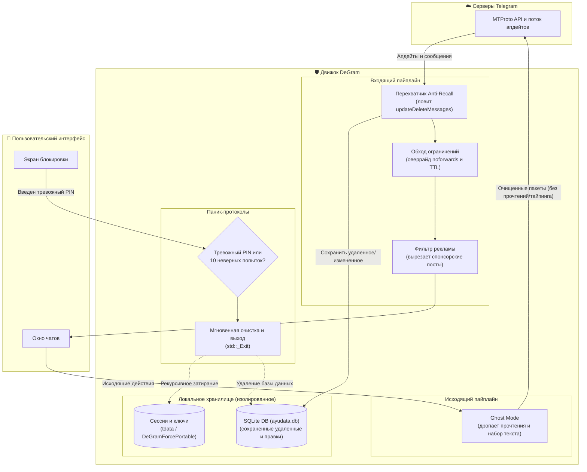

<div align="center">


# DeGram Desktop
**Портативный Telegram Desktop форк с акцентом на приватность, который возвращает контроль в ваши руки.**

[](https://github.com/intelQong/DeGram/releases)
[](LICENSE)
[](#-скачать-портативные-бинарники)
[](#-сборка-из-исходников)
[-success?style=flat-square)](#-ноль-телеметрии)

[English](README.md) · [Русский](README-RU.md) · [Скачать](#-скачать-портативные-бинарники) · [Возможности](#-что-умеет-degram) · [Под капотом](#-под-капотом) · [Сборка](#-сборка-из-исходников) · [Архитектура](docs/ARCHITECTURE.md)

</div>

---

## ⚡ Зачем DeGram?

Официальный Telegram Desktop хорош, но у него есть несколько раздражающих дефолтов: любой собеседник может удалить сообщение из вашей истории переписки без спроса, запреты на пересылку мешают сохранить полезные материалы, в фоне крутится телеметрия, а данные сессий разлетаются по системным папкам и реестру.

**DeGram** — это чистый, полностью портативный форк Telegram Desktop, который решает эти проблемы и не мешает работать:

* **Сохраняет удаленные и отредактированные сообщения локально** в быстрой базе данных SQLite с историей правок и таймстемпами.
* **Экстренная паник-очистка (KABOOM)**, которая намертво затирает локальные ключи сессий и базы данных при вводе тревожного пин-кода.
* **Режим призрака (Ghost mode)**, позволяющий читать чаты и смотреть истории, не отправляя отчетов о прочтении, статусов набора текста и отметок «в сети».
* **Обход запретов на копирование и сохранение** — пересылайте и скачивайте медиа из закрытых каналов и сохраняйте одноразовые (TTL) фото и видео.
* **100% портативность из коробки**: работает прямо с флешки или зашифрованного контейнера на Linux, Windows и macOS без записей в реестр и мусора в системе.
* **Ноль телеметрии**: никаких краш-репортов Sentry, аналитики и сторонних трекеров.

---

## 🚀 Что умеет DeGram

### 🛡️ Anti-Recall: ни одно сообщение не пропадет
Когда кто-то удаляет или редактирует сообщение в личке или группе, серверы Telegram присылают событие `updateDeleteMessages` или `updateEditMessage`. DeGram перехватывает его прямо на уровне MTProto:
* **Удаленные сообщения** остаются в ленте чата с аккуратной иконкой `🧹`, чтобы вы знали, что их удалили.
* **Отредактированные сообщения** сохраняют полную хронологию правок — кликните на сообщение, чтобы увидеть предыдущие версии и время изменения.
* Всё сохраняется локально во встроенной базе SQLite (`ayudata.db`), работающей в высокопроизводительном режиме WAL.

### 💣 Код под принуждением и паник-очистка (KABOOM)
Если вас заставляют разблокировать клиент, DeGram обеспечивает надежное правдоподобное отрицание:
* **Тревожный PIN-код**: Задайте альтернативный PIN на экране блокировки. Его ввод мгновенно запускает рекурсивное криптографическое затирание всех сессионных токенов, ключей авторизации и баз в `tdata/`, после чего процесс мгновенно завершается через `std::_Exit(0)`.
* **Защита от подбора**: 10 неверных попыток ввода пароля на экране блокировки автоматически вызывают ту же самую очистку KABOOM.
* **Кнопка «Убить приложение»**: Добавлена прямо в главное меню для мгновенного жесткого завершения процесса в обход стандартных хуков и без дампов памяти.

### 👻 Ghost Protocol: полная невидимость
Детальный контроль над тем, что видят сервер и собеседники:
* **Не слать отчеты о прочтении**: Читайте входящие сообщения в диалогах, группах и каналах без отправки `messages.readHistory`.
* **Скрыть статус «в сети»**: Блокирует отправку статуса онлайна — ваш аккаунт выглядит офлайн или «был(а) недавно».
* **Глушить статус набора текста**: Дропает `messages.setTyping`, поэтому никто не увидит, что вы пишете текст, записываете голос или отправляете файл.
* **Анонимные истории**: Смотрите истории пользователей инкогнито без попадания в список просмотров.
* **Локальное прочтение**: Отмечайте чаты прочитанными на своем экране, чтобы сбросить счетчики, не синхронизируя статус прочтения с сервером.

### 🔓 Обход ограничений и DRM
* **Сохранение защищенного контента**: Клиентский оверрайд для каналов и чатов с флагами `noforwards` или `restrict_saving_content`. Качайте видео, сохраняйте войсы и копируйте текст без ограничений.
* **Сохранение самоуничтожающихся (TTL) медиа**: Одноразовые исчезающие фото и видео больше не исчезают по таймеру — они остаются доступными, пока вы сами их не закроете.

### 🧰 Приятные мелочи на каждый день
* **До 100 аккаунтов**: Мы подняли лимит аккаунтов со стандартных 3 (или 6 с Premium) до **100 одновременных аккаунтов** с мгновенным переключением.
* **Никакой рекламы**: Спонсорские рекламные посты в каналах вырезаются до расчета верстки интерфейса.
* **Режим стримера**: Автоматически скрывает номера телефонов, юзернеймы и текст уведомлений при демонстрации экрана или записи видео.
* **Одна классическая синяя иконка**: Никаких громоздких меню выбора тем и иконок — только знакомый синий бумажный самолетик на всех платформах.

---

## 🛠️ Под капотом

Вот как DeGram встраивается между транспортом MTProto и экраном:



---

## 📦 Скачать портативные бинарники

DeGram поставляется как 100% портативные автономные архивы. Никаких установщиков, фоновых служб обновления и требований к правам root/администратора. Всё хранится локально внутри одной папки (`DeGramForcePortable` или `tdata`).

| ОС | Архитектура | Пакет | Размер | Хеш |
| :--- | :--- | :--- | :--- | :--- |
| **Linux** | `x86_64` (AMD64) | [**DeGram-Portable-7.0.21-x86_64.tar.xz**](https://github.com/intelQong/DeGram/releases) | ~96 МБ | [SHA256](https://github.com/intelQong/DeGram/releases) |
| **Linux** | `aarch64` (ARM64) | [**DeGram-Portable-7.0.21-arm64.tar.xz**](https://github.com/intelQong/DeGram/releases) | ~69 МБ | [SHA256](https://github.com/intelQong/DeGram/releases) |
| **Windows** | `x86_64` (64-бит) | [**DeGram-Portable-7.0.21-Windows-x64.zip**](https://github.com/intelQong/DeGram/releases) | Автономный `.zip` | [SHA256](https://github.com/intelQong/DeGram/releases) |
| **macOS** | Universal (`arm64` + `x86_64`) | [**DeGram-Portable-7.0.21-macOS.zip**](https://github.com/intelQong/DeGram/releases) | Автономный `.app` | [SHA256](https://github.com/intelQong/DeGram/releases) |

### Быстрый старт

#### 🐧 Linux (x86_64 и ARM64)
```bash
# 1. Скачайте и проверьте SHA-256
sha256sum -c DeGram-Portable-7.0.21-x86_64.tar.xz.sha256

# 2. Распакуйте в любое место (домашняя папка, /opt или флешка)
tar -xf DeGram-Portable-7.0.21-x86_64.tar.xz
cd DeGram/

# 3. Запустите с изолированным локальным профилем
./DeGram.sh
```

#### 🪟 Windows (x64)
1. Распакуйте `DeGram-Portable-7.0.21-Windows-x64.zip` в любую папку или на флешку.
2. Запустите `DeGram.exe`. Ваши сессии, чаты и база сохраненных сообщений хранятся в папке `DeGramForcePortable\` прямо рядом с программой.

#### 🍏 macOS (Apple Silicon и Intel)
1. Распакуйте `DeGram-Portable-7.0.21-macOS.zip`.
2. Перетащите `DeGram.app` в папку «Программы» или на внешний накопитель.
3. Если Gatekeeper блокирует неподписанное приложение при первом запуске:
   ```bash
   xattr -cr DeGram.app
   ```
4. Откройте `DeGram.app`.

---

## 🔍 Карта кодовой базы

Хотите посмотреть, как это устроено в коде? Вот основные точки входа:

| Фича | Что делает | Файлы |
| :--- | :--- | :--- |
| **Ядро Anti-Recall** | Ловит удаления и правки, сохраняет данные в SQLite | [`ayu/data/`](Telegram/SourceFiles/ayu/), [`history.cpp`](Telegram/SourceFiles/history/history.cpp) |
| **Паник-протокол KABOOM** | Проверяет тревожный PIN, считает ошибки, затирает данные и зовет `_Exit(0)` | [`window_lock_widgets.cpp`](Telegram/SourceFiles/window/window_lock_widgets.cpp), [`ayu_settings.cpp`](Telegram/SourceFiles/ayu/ayu_settings.cpp) |
| **Ghost Protocol** | Дропает исходящие отчеты о прочтении, статусы набора текста и онлайна | [`data_send_action_manager.cpp`](Telegram/SourceFiles/data/data_send_action_manager.cpp), [`apiwrap.cpp`](Telegram/SourceFiles/apiwrap.cpp) |
| **Кнопка Kill App** | Моментальное аварийное завершение процесса в главном меню | [`window_main_menu.cpp`](Telegram/SourceFiles/window/window_main_menu.cpp) |
| **Движок портативности** | Определяет рабочий каталог, загружает `DeGramForcePortable` | [`core/launcher.cpp`](Telegram/SourceFiles/core/launcher.cpp) |
| **Обход ограничений** | Принудительно выставляет `allowsForwarding() == true` для каналов, чатов и медиа | [`data_channel.cpp`](Telegram/SourceFiles/data/data_channel.cpp), [`data_chat.cpp`](Telegram/SourceFiles/data/data_chat.cpp) |
| **Брендинг** | Чистые строки DeGram и классическая синяя иконка | [`ayu_logo.h`](Telegram/SourceFiles/ayu/ui/ayu_logo.h), [`icon_picker.cpp`](Telegram/SourceFiles/ayu/ui/components/icon_picker.cpp) |

---

## 🔨 Сборка из исходников

DeGram использует **C++20**, **Qt 6** и **CMake**.

### Debug-сборка (самая быстрая для тестирования)
```bash
cmake --build out --config Debug --target Telegram
```

### Официальное Docker-окружение (Linux)
Чтобы воспроизвести чистую и изолированную среду сборки под Linux:
```bash
Telegram/build/docker/centos_env/build_debug.sh
```

### Скрипты упаковки
```bash
# Портативный .tar.xz для Linux
./scripts/build_portable.sh "7.0.21" "x86_64" "out/Release/DeGram" "."

# Портативный .zip для Windows (PowerShell)
./scripts/build_portable_windows.ps1 -Version "7.0.21" -OutputDir "."

# Портативный .zip для macOS
./scripts/build_portable_macos.sh "7.0.21" "out/Release/DeGram.app" "."
```

---

## 📜 Лицензия и благодарности

DeGram Desktop распространяется под свободной лицензией **[GNU General Public License v3.0](LICENSE)** с исключением **[OpenSSL Exception](LICENSE.EXCEPTION)**.

* Создан на базе надежного открытого кода [Telegram Desktop](https://github.com/telegramdesktop/tdesktop) и [Desktop App Toolkit](https://github.com/desktop-app).
* **Дисклеймер**: DeGram Desktop — независимый проект с открытым исходным кодом, который никак не связан с Telegram FZ-LLC, не спонсируется и не поддерживается ими.
