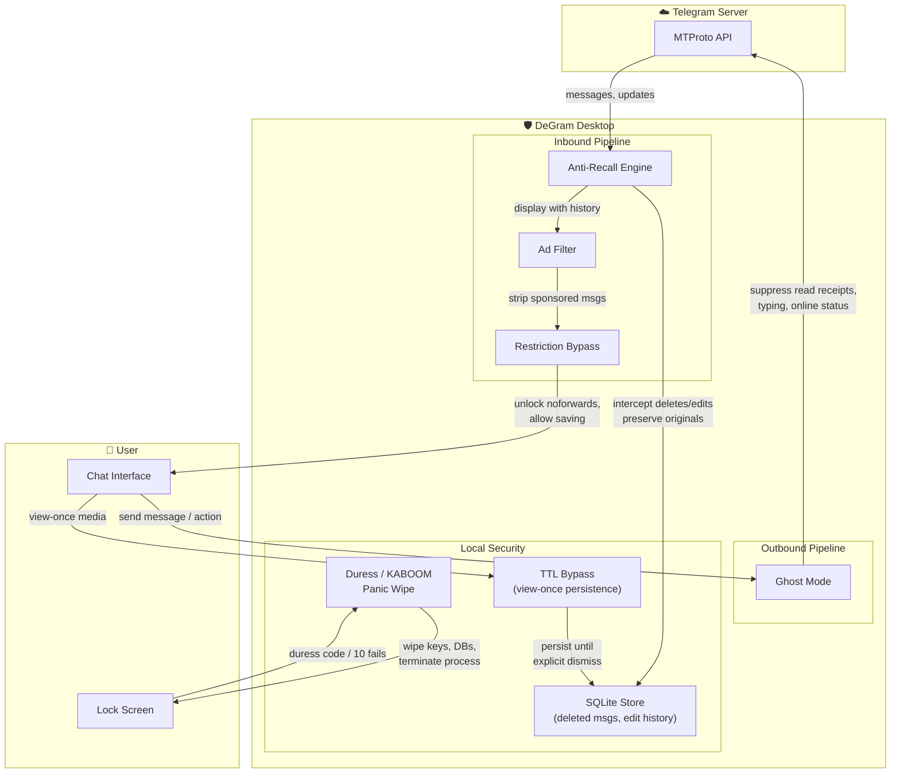

<div align="center">


# DeGram Desktop

**Privacy-first, portable Telegram Desktop client with Anti-Recall, Duress Panic Wipe (KABOOM), Ghost Mode, and Full Restriction Bypasses.**

[](https://github.com/intelQong/DeGram/releases)
[](LICENSE)
[](#portable-cross-platform-edition-official)
[](#build-from-source)

[English](README.md) · [Русский](README-RU.md) · [Download](#portable-cross-platform-edition-official) · [Features](#features) · [Architecture](docs/ARCHITECTURE.md) · [Build](#build-from-source) · [Credits](#credits)

</div>

---

## Features

### 🛡️ Anti-Recall — Message History
Messages deleted or edited by other participants are preserved locally in a SQLite database with full edit history and timestamps. Nothing disappears unless *you* decide it should.

### 💣 Duress Passcode / KABOOM Wipe
Enter a designated duress passcode on the lock screen — or exceed 10 failed unlock attempts — to instantly and recursively wipe all session keys, local databases, and terminate the process. Plausible deniability by design.

### 🛑 Kill the App Button
Direct emergency exit button located right in the main drawer menu to immediately abort the process without lingering in memory or leaving active background threads.

### 🔓 Restriction Bypasses
Save images, videos, and forward messages freely from restricted or protected channels. `noforwards` flags, `restrict_saving_content`, and story forwarding restrictions are bypassed client-side.

### ⏳ TTL Media Persistence
View-once photos and videos remain visible until you explicitly dismiss them. Self-destruct timers are suppressed locally.

### 👻 Ghost Mode
Granular control over your visibility: suppress read receipts, typing indicators, and online presence — individually or all at once.

### 🚫 No Advertisements
All sponsored messages and ads injected into channels are removed before rendering.

### 👥 Unlimited Multi-Account
Support for up to **100 concurrent accounts** with seamless switching.

### 📡 Zero Telemetry
Crash reporting to third-party endpoints is disabled by default. No tracking, no analytics, no data leaves your machine.

---

## How It Works

DeGram Desktop sits between the Telegram server and your screen, intercepting and modifying the data flow at key points:



> **Everything stays local.** Anti-recall data, edit history, and settings are stored in a SQLite database on your machine. No data is sent to external servers — telemetry and crash reporting endpoints are disabled by default.

---

## Portable Cross-Platform Edition (Official)

**DeGram Desktop is designed to be 100% portable out-of-the-box across Linux, Windows, and macOS.** No installation, administrator (`sudo`) privileges, or external package managers are required. All user sessions, chats, anti-recall SQLite databases (`ayudata.db`), and settings remain strictly isolated inside the local portable directory (`DeGramForcePortable` / `tdata`), leaving zero footprints on the host system and making it ideal for running from USB flash drives.

### 🐧 Linux (x86_64 & ARM64)

Download the portable tarball for your architecture from the [Releases](https://github.com/intelQong/DeGram/releases) page:

```bash
tar -xf DeGram-Portable-7.0.16-x86_64.tar.xz
cd DeGram/
./DeGram.sh   # or ./degram
```

*Runs out-of-the-box on Ubuntu, Debian, Fedora, Arch, openSUSE, and any standard Linux distribution.*

### 🪟 Windows (x64)

Download the portable `.zip` from the [Releases](https://github.com/intelQong/DeGram/releases) page:

1. Extract `DeGram-Portable-7.0.16-Windows-x64.zip` to any folder or USB flash drive.
2. Double-click `DeGram.exe`.

### 🍏 macOS (Universal / Apple Silicon & Intel)

Download the portable `.zip` from the [Releases](https://github.com/intelQong/DeGram/releases) page:

1. Extract `DeGram-Portable-7.0.16-macOS.zip` to any directory or external USB drive.
2. Double-click `DeGram.app`.
3. *(Optional)* If macOS Gatekeeper blocks running downloaded software, open Terminal and run:
   ```bash
   xattr -cr /path/to/DeGram/DeGram.app
   ```
   All sessions, chats, and SQLite anti-recall databases remain strictly isolated inside the `DeGramForcePortable/` directory.

---

## Build from Source

DeGram Desktop is built with **C++20**, **Qt 6**, and **CMake**. It shares the build system with Telegram Desktop.

### Directory Layout

```
<BuildPath>/
├── tdesktop/          # This repository (DeGram)
├── Libraries/         # Dependencies (Linux/macOS)
├── win64/Libraries/   # Dependencies (Windows x64)
└── ThirdParty/        # Build tools
```

### Build (Debug)

```bash
cmake --build out --config Debug --target Telegram
```

### Build via Docker (Linux)

```bash
Telegram/build/docker/centos_env/build_debug.sh
```

### Package Portable Builds Locally

```bash
# Linux portable (.tar.xz)
./scripts/build_portable.sh "7.0.16" "x86_64" "out/Release/DeGram" "."

# Windows portable (.zip - PowerShell)
./scripts/build_portable_windows.ps1 -Version "7.0.16" -OutputDir "."

# macOS portable (.zip)
./scripts/build_portable_macos.sh "7.0.16" "out/Release/DeGram.app" "."
```

---

## Architecture & Subsystems

| Subsystem | Implementation | Key Files |
|-----------|---------------|-----------|
| Anti-Recall | SQLite-backed message retention, intercepts deletion/edit updates | `ayu/data/ayu_database.cpp`, `history.cpp` |
| Duress / KABOOM | Passcode check → recursive wipe → process kill | `window_lock_widgets.cpp`, `ayu_settings.cpp` |
| Kill App Button | Immediate ungraceful exit from drawer menu | `window_main_menu.cpp` |
| Portable Mode | Automatic detection of `DeGramForcePortable` | `core/launcher.cpp` |
| Restriction Bypass | `allowsForwarding()` → `true` across all peer types | `data_channel.cpp`, `data_chat.cpp`, `data_user.cpp` |
| Ghost Mode | Suppress read receipts, typing, online status | `ayu_settings.cpp`, `data_send_action_manager.cpp` |
| Ad Removal | Filter sponsored messages from API responses | `ayu_settings.cpp`, `data_session.cpp` |
| Multi-Account | `kMaxAccounts = 100` | `main_domain.h` |

For the full technical specification, see [`docs/ARCHITECTURE.md`](docs/ARCHITECTURE.md).

---

## Credits

DeGram Desktop is built upon the open-source Telegram ecosystem:

| Project | Contribution |
|---------|-------------|
| [**Telegram Desktop**](https://github.com/telegramdesktop/tdesktop) | Official base client and MTProto protocol implementation |
| [**Telegraher**](https://github.com/nikitasius/Telegraher) | Duress passcode, KABOOM panic wipe, 100-account expansion, forwarding bypasses |
| [**AyuGram Desktop**](https://github.com/AyuGram/AyuGramDesktop) | Ghost mode, message filters, anti-recall SQLite engine |
| [**Desktop App Toolkit**](https://github.com/desktop-app) | Shared C++ libraries — `lib_ui`, `lib_base`, `lib_rpl`, `lib_crl` |

---

## License

DeGram Desktop is licensed under the [GNU General Public License v3.0](LICENSE) with an OpenSSL linking exception.

<div align="center">
<sub>Made with privacy, portability, and sovereignty in mind.</sub>
</div>
