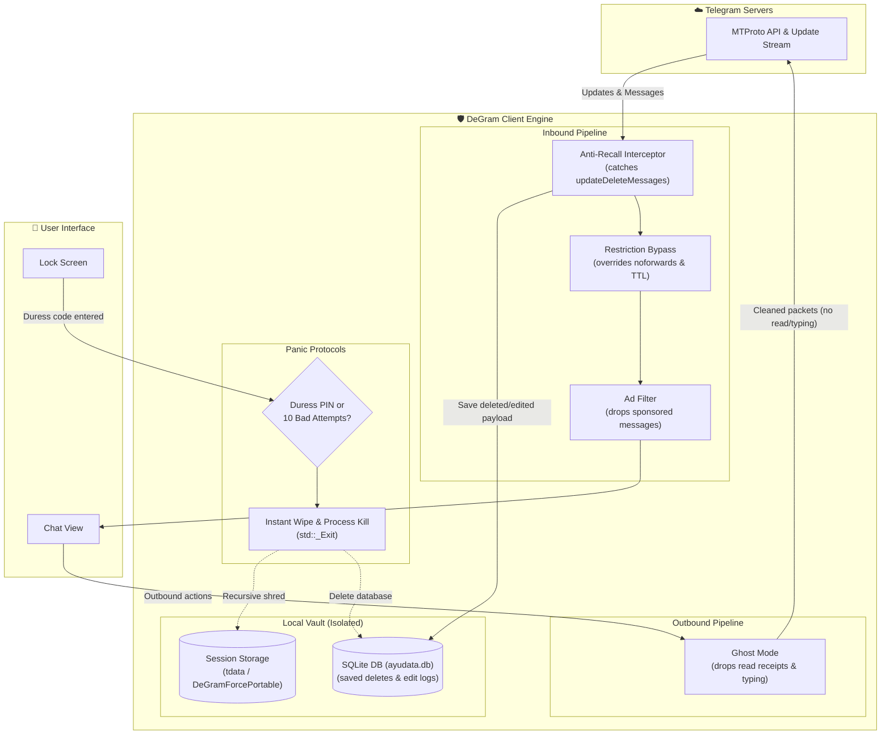

<div align="center">


# DeGram Desktop
**A portable, privacy-focused Telegram Desktop fork that puts you back in control.**

[](https://github.com/intelQong/DeGram/releases)
[](LICENSE)
[](#-grab-the-portable-binaries)
[](#-building-from-source)
[-success?style=flat-square)](#-zero-telemetry)

[English](README.md) · [Русский](README-RU.md) · [Download](#-grab-the-portable-binaries) · [Features](#-what-degram-does) · [How It Works](#-under-the-hood) · [Build](#-building-from-source) · [Architecture](docs/ARCHITECTURE.md)

</div>

---

## ⚡ Why DeGram?

Official Telegram Desktop is great, but it has a few frustrating defaults: anyone can retract messages from your chat history without asking, forwarding restrictions block you from saving public reference material, telemetry runs in the background, and sensitive session data gets scattered all over your OS registry and user folders.

**DeGram** is a clean, fully portable fork of Telegram Desktop that fixes these pain points without getting in your way:

* **Saves deleted & edited messages locally** in a fast SQLite database with edit history and timestamps.
* **Emergency panic wipe (KABOOM)** that completely shreds your local session keys and databases if a duress passcode is entered.
* **Ghost mode** that lets you read chats and view stories without broadcasting read receipts, typing status, or online beacons.
* **Bypasses copy & save restrictions** so you can forward or download media from restricted channels and keep view-once (TTL) media from disappearing.
* **100% portable out-of-the-box**: runs straight from a USB thumb drive or encrypted container on Linux, Windows, and macOS with zero registry writes or leftover files.
* **Zero telemetry**: no Sentry crash reporting, no analytics pingbacks, no third-party data tracking.

---

## 🚀 What DeGram Does

### 🛡️ Anti-Recall: Never Lose a Message
When someone deletes or edits a message in a private chat or group, Telegram servers push an `updateDeleteMessages` or `updateEditMessage` event. DeGram intercepts this at the MTProto layer:
* **Deleted messages** stay right in your chat feed, marked with a discrete `🧹` icon so you know it was retracted.
* **Edits** keep a full chronological log—click any edited message to inspect previous revisions and timestamps.
* Everything is stored locally in an embedded SQLite database (`ayudata.db`) running in high-performance WAL mode.

### 💣 Duress Code & Panic Wipe (KABOOM)
If you're ever forced to unlock your client under pressure, DeGram gives you real plausible deniability:
* **Custom Duress PIN**: Configure a secondary PIN on your lock screen. Entering it immediately invokes a recursive cryptographic shred of all session tokens, authorization keys, and databases in `tdata/`, followed by an instant `std::_Exit(0)`.
* **Anti-Brute Force**: 10 failed passcode attempts on the lock screen triggers the exact same KABOOM wipe automatically.
* **"Kill the App" button**: Placed directly in the main drawer menu for an instant, ungraceful kill that bypasses standard exit hooks and leaves zero memory dumps.

### 👻 Ghost Protocol: Total Stealth
Full granular control over what the server and your contacts can see:
* **Don't Send Read Receipts**: Read incoming messages in private chats, groups, and channels without sending `messages.readHistory`.
* **Hide Online Presence**: Suppress online presence pings so your account appears permanently offline or as "last seen recently".
* **Mute Typing Telemetry**: Drops `messages.setTyping` actions so nobody knows when you're typing, recording voice, or uploading files.
* **Anonymous Stories**: Watch user stories incognito without showing up in their viewer list.
* **Local Read Toggle**: Mark a chat read on your screen to clear notification badges without syncing the read status back to the server.

### 🔓 Restriction & DRM Bypasses
* **Save Protected Media**: Client-side override on channels and chats with `noforwards` or `restrict_saving_content` enabled. Download videos, save voice notes, and copy text freely.
* **View-Once / TTL Persistence**: One-time self-destructing photos and videos won't disappear on a timer—they stay available until you explicitly close them.

### 🧰 Everyday Quality of Life
* **Up to 100 Accounts**: We raised the account limit from Telegram's 3 (or Premium's 6) up to **100 concurrent accounts** with instantaneous hot-switching.
* **No Sponsored Ads**: Ad injection payloads in public channels are stripped before UI layout calculation.
* **Streamer Mode**: Automatically masks phone numbers, usernames, and incoming notification contents when screen sharing or recording.
* **Single Clean Blue Icon**: No cluttered icon theme pickers—just the classic, recognizable Telegram paper-plane icon across all platforms.

---

## 🛠️ Under the Hood

Here is how DeGram sits between Telegram's MTProto transport and your screen:



---

## 📦 Grab the Portable Binaries

DeGram is packaged as 100% portable, standalone archives. No installer, no background updater services, and no root/admin permissions needed. Everything stays neatly inside its local folder (`DeGramForcePortable` or `tdata`).

| OS | Architecture | Package | Size | Checksum |
| :--- | :--- | :--- | :--- | :--- |
| **Linux** | `x86_64` (AMD64) | [**DeGram-Portable-7.0.21-x86_64.tar.xz**](https://github.com/intelQong/DeGram/releases) | ~96 MB | [SHA256](https://github.com/intelQong/DeGram/releases) |
| **Linux** | `aarch64` (ARM64) | [**DeGram-Portable-7.0.21-arm64.tar.xz**](https://github.com/intelQong/DeGram/releases) | ~69 MB | [SHA256](https://github.com/intelQong/DeGram/releases) |
| **Windows** | `x86_64` (64-bit) | [**DeGram-Portable-7.0.21-Windows-x64.zip**](https://github.com/intelQong/DeGram/releases) | Standalone `.zip` | [SHA256](https://github.com/intelQong/DeGram/releases) |
| **macOS** | Universal (`arm64` + `x86_64`) | [**DeGram-Portable-7.0.21-macOS.zip**](https://github.com/intelQong/DeGram/releases) | Standalone `.app` | [SHA256](https://github.com/intelQong/DeGram/releases) |

### Quick Start

#### 🐧 Linux (x86_64 & ARM64)
```bash
# 1. Download and verify SHA-256
sha256sum -c DeGram-Portable-7.0.21-x86_64.tar.xz.sha256

# 2. Extract anywhere (home directory, /opt, or a USB stick)
tar -xf DeGram-Portable-7.0.21-x86_64.tar.xz
cd DeGram/

# 3. Run with local profile isolation
./DeGram.sh
```

#### 🪟 Windows (x64)
1. Unzip `DeGram-Portable-7.0.21-Windows-x64.zip` into any folder or USB drive.
2. Double-click `DeGram.exe`. Your sessions, chats, and anti-recall database are saved in the local `DeGramForcePortable\` folder right next to the executable.

#### 🍏 macOS (Apple Silicon & Intel)
1. Unzip `DeGram-Portable-7.0.21-macOS.zip`.
2. Move `DeGram.app` to your Applications folder or external drive.
3. If macOS Gatekeeper complains about unsigned binaries on first launch:
   ```bash
   xattr -cr DeGram.app
   ```
4. Open `DeGram.app`.

---

## 🔍 Codebase Map

Want to see where the magic happens? Here are the main touchpoints:

| Feature | What it does | Key Files |
| :--- | :--- | :--- |
| **Anti-Recall Core** | Hooks message deletions & edits, dumps records to SQLite | [`ayu/data/`](Telegram/SourceFiles/ayu/), [`history.cpp`](Telegram/SourceFiles/history/history.cpp) |
| **KABOOM Panic Protocol** | Checks duress PIN, counts failed attempts, recursive wipe & `_Exit(0)` | [`window_lock_widgets.cpp`](Telegram/SourceFiles/window/window_lock_widgets.cpp), [`ayu_settings.cpp`](Telegram/SourceFiles/ayu/ayu_settings.cpp) |
| **Ghost Protocol** | Drops outbound read receipts, typing telemetry, and presence beacons | [`data_send_action_manager.cpp`](Telegram/SourceFiles/data/data_send_action_manager.cpp), [`apiwrap.cpp`](Telegram/SourceFiles/apiwrap.cpp) |
| **Emergency Kill App** | Ungraceful instant exit button in the main menu | [`window_main_menu.cpp`](Telegram/SourceFiles/window/window_main_menu.cpp) |
| **Portable Engine** | Detects local working directory, loads `DeGramForcePortable` | [`core/launcher.cpp`](Telegram/SourceFiles/core/launcher.cpp) |
| **Restriction Bypass** | Forces `allowsForwarding() == true` on channels, chats, and media | [`data_channel.cpp`](Telegram/SourceFiles/data/data_channel.cpp), [`data_chat.cpp`](Telegram/SourceFiles/data/data_chat.cpp) |
| **Branding** | Enforces clean DeGram strings and classic blue icon | [`ayu_logo.h`](Telegram/SourceFiles/ayu/ui/ayu_logo.h), [`icon_picker.cpp`](Telegram/SourceFiles/ayu/ui/components/icon_picker.cpp) |

---

## 🔨 Building from Source

DeGram uses **C++20**, **Qt 6**, and **CMake**.

### Debug Build (Fastest for testing)
```bash
cmake --build out --config Debug --target Telegram
```

### Official Docker Environment (Linux)
To reproduce the clean, isolated Linux build environment:
```bash
Telegram/build/docker/centos_env/build_debug.sh
```

### Packaging Scripts
```bash
# Linux portable .tar.xz
./scripts/build_portable.sh "7.0.21" "x86_64" "out/Release/DeGram" "."

# Windows portable .zip (PowerShell)
./scripts/build_portable_windows.ps1 -Version "7.0.21" -OutputDir "."

# macOS portable .zip
./scripts/build_portable_macos.sh "7.0.21" "out/Release/DeGram.app" "."
```

---

## 📜 License & Acknowledgments

DeGram Desktop is open-source under the **[GNU General Public License v3.0](LICENSE)** with the **[OpenSSL Exception](LICENSE.EXCEPTION)**.

* Built on top of the battle-tested [Telegram Desktop](https://github.com/telegramdesktop/tdesktop) codebase and [Desktop App Toolkit](https://github.com/desktop-app).
* **Disclaimer**: DeGram Desktop is an independent open-source project and is not affiliated with, sponsored by, or endorsed by Telegram FZ-LLC.
