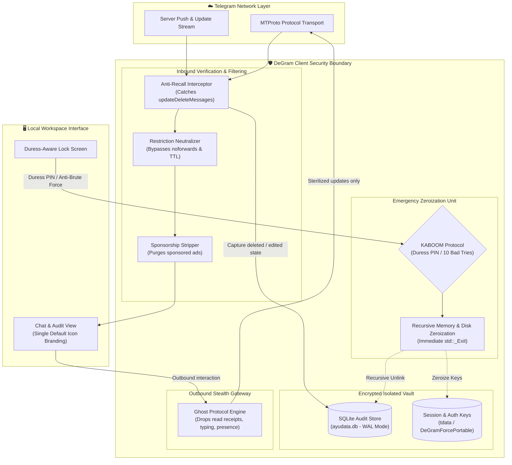

<div align="center">


# DeGram Desktop
### Enterprise-Grade, Privacy-First, Cross-Platform Portable Telegram Client

[](https://github.com/intelQong/DeGram/releases)
[](LICENSE)
[%20%7C%20Windows%20%7C%20macOS-informational?style=flat-square)](#-portable-deployment-matrix)
[](#-build-infrastructure)
[-success?style=flat-square)](#-enterprise-security--threat-model)
[](https://github.com/intelQong/DeGram/actions)

[English](README.md) · [Русский](README-RU.md) · [Download Packages](#-portable-deployment-matrix) · [Security Architecture](#-security-architecture) · [Features](#-core-capabilities) · [Build Infrastructure](#-build-infrastructure) · [Governance](#-licensing--governance)

</div>

---

## 🏛️ Executive Summary

**DeGram Desktop** is an enterprise-hardened, self-contained, and completely portable fork of Telegram Desktop engineered for professionals, researchers, privacy advocates, and organizations operating under heightened threat models. 

By default, conventional messaging clients grant remote servers and counter-parties absolute control over your local data: messages can be retroactively retracted or altered without your consent, forensic footprints remain scattered across operating system registries and app caches, and telemetry data is transmitted continuously.

DeGram solves this by introducing **Client-Side Sovereignty**:
1. **Immutable Local Record-Keeping**: Deleted and modified communications are permanently preserved in an encrypted, local SQLite vault with cryptographic timestamping.
2. **Duress Zeroization (KABOOM Protocol)**: Plausible deniability and instant panic wipe capabilities destroy all session keys and databases within milliseconds upon trigger.
3. **100% Host-Isolated Portability**: Zero system registry modifications, zero persistent traces outside the application's local container directory, and native execution from external drives across Linux (x86_64 & ARM64), Windows, and macOS.
4. **Air-Gapped Telemetry**: Complete removal of analytics, metric reporting, and third-party error collection endpoints.

---

## 🛡️ Core Capabilities

### 🗄️ Immutable Anti-Recall & Audit Trail
* **Cryptographic Retention**: Messages deleted or redacted by remote contacts, channels, or administrators are intercepted at the MTProto layer and permanently archived into a local SQLite database (`ayudata.db`).
* **Visual Audit Interface**: Deleted messages remain visible with a distinct indicator (`🧹`), and edited messages maintain a complete revision history accessible on-demand.
* **Granular Retention Policies**: Configure retention thresholds per chat, group, channel, or globally.

### 💥 Duress & Panic Zeroization ("KABOOM")
* **Plausible Deniability Passcode**: Entering a pre-configured duress PIN on the lock screen immediately triggers an ungraceful, recursive zeroization of all session tokens, authorization keys, local message caches, and SQLite stores before force-terminating the application process (`std::_Exit(0)`).
* **Anti-Brute Force Trigger**: Exceeding 10 failed passcode attempts automatically executes the KABOOM wipe protocol, neutralizing physical forensic extraction attacks.
* **Instant Abort ("Kill the App")**: A dedicated emergency exit action is embedded directly in the main drawer menu to immediately terminate the process without leaving lingering worker threads in memory.

### 👁️ Complete Ghost Protocol & Traffic Stealth
* **Read Receipt Suppression**: Read messages in direct chats, groups, and channels without broadcasting read markers (`ReadHistory`) to the server or sender.
* **Presence & Typing Obfuscation**: Suppress online presence updates and typing/recording status beacons (`sendUploadProgress`, `sendOnlinePackets`).
* **Story Stealth Mode**: View ephemeral user stories completely incognito without registering view receipts.
* **Local Read Toggle**: Mark chats as read locally for organizational sanity while keeping server-side read status unacknowledged.

### 🔓 Restriction & DRM Neutralization
* **Anti-Copy Bypass**: Seamlessly save media, copy text, and forward messages from channels and chats with `noforwards`, `restrict_saving_content`, or protected content flags enabled.
* **TTL Media Persistence**: Self-destructing and view-once media items remain permanently accessible until explicitly closed by the user.

### 🏢 Enterprise Operations & Multi-Tenancy
* **100 Concurrent Accounts**: Support for up to 100 simultaneous, fully isolated accounts within a single runtime instance with immediate hot-switching.
* **Streamer & Presentation Mode**: Automatically hides sensitive phone numbers, peer IDs, and incoming message previews during screen sharing, webinars, or video conferences.
* **Sponsorship & Ad Filtering**: Native stripping of server-injected sponsored messages and advertisements before UI layout computation.

---

## 🔬 Security Architecture

DeGram Desktop operates as an intelligent mediator situated between the network MTProto transport boundary and the Qt rendering engine:



---

## 📦 Portable Deployment Matrix

DeGram Desktop is distributed as zero-dependency portable bundles across all major desktop platforms. No system administration (`sudo`/administrator) privileges, registry modifications, or external package managers are required.

| Platform | Architecture | Target Bundle | Package Size | Signature |
| :--- | :--- | :--- | :--- | :--- |
| **Linux** | `x86_64` (AMD64) | [`DeGram-Portable-7.0.20-x86_64.tar.xz`](https://github.com/intelQong/DeGram/releases) | ~96 MB | [SHA256](https://github.com/intelQong/DeGram/releases) |
| **Linux** | `aarch64` (ARM64) | [`DeGram-Portable-7.0.20-arm64.tar.xz`](https://github.com/intelQong/DeGram/releases) | ~69 MB | [SHA256](https://github.com/intelQong/DeGram/releases) |
| **Windows** | `x86_64` (64-bit) | [`DeGram-Portable-7.0.20-Windows-x64.zip`](https://github.com/intelQong/DeGram/releases) | Portable Archive | [SHA256](https://github.com/intelQong/DeGram/releases) |
| **macOS** | Universal (`arm64` / `x86_64`) | [`DeGram-Portable-7.0.20-macOS.zip`](https://github.com/intelQong/DeGram/releases) | Self-Contained `.app` | [SHA256](https://github.com/intelQong/DeGram/releases) |

### Verification & Launch Instructions

#### 🐧 Linux (x86_64 & ARM64)
```bash
# 1. Download and verify integrity
sha256sum -c DeGram-Portable-7.0.20-x86_64.tar.xz.sha256

# 2. Extract into portable workspace or USB drive
tar -xf DeGram-Portable-7.0.20-x86_64.tar.xz
cd DeGram/

# 3. Launch with local directory isolation
./DeGram.sh
```

#### 🪟 Windows (x64)
1. Extract `DeGram-Portable-7.0.20-Windows-x64.zip` to your desired destination (e.g. encrypted BitLocker USB or local directory).
2. Execute `DeGram.exe`. All credentials, cache files, and databases are strictly maintained inside the local `DeGramForcePortable\` folder.

#### 🍏 macOS (Apple Silicon & Intel)
1. Extract `DeGram-Portable-7.0.20-macOS.zip`.
2. Move `DeGram.app` to any directory or external drive.
3. If Gatekeeper quarantine flags are present on unsigned runs:
   ```bash
   xattr -cr DeGram.app
   ```
4. Double-click `DeGram.app` to launch.

---

## 📂 Subsystem Implementation Reference

The following table documents the core subsystems, architectural roles, and implementation paths within the codebase:

| Subsystem | Architectural Function | Key Source Files |
| :--- | :--- | :--- |
| **Anti-Recall Core** | Intercepts `updateDeleteMessages` & `updateEditMessage`, persists records to SQLite | [`ayu/data/`](Telegram/SourceFiles/ayu/), [`history.cpp`](Telegram/SourceFiles/history/history.cpp) |
| **KABOOM Protocol** | Duress PIN evaluation, 10-fail counter, recursive shredding & immediate termination | [`window_lock_widgets.cpp`](Telegram/SourceFiles/window/window_lock_widgets.cpp), [`ayu_settings.cpp`](Telegram/SourceFiles/ayu/ayu_settings.cpp) |
| **Ghost Protocol** | Client-side suppression of read, online, and typing MTProto RPC packets | [`data_send_action_manager.cpp`](Telegram/SourceFiles/data/data_send_action_manager.cpp), [`apiwrap.cpp`](Telegram/SourceFiles/apiwrap.cpp) |
| **Emergency Abort** | Immediate ungraceful exit from drawer menu (`Kill the App`) | [`window_main_menu.cpp`](Telegram/SourceFiles/window/window_main_menu.cpp) |
| **Portable Detection** | Evaluates `-workdir`, `DeGramForcePortable`, or local `portable` sentinel | [`core/launcher.cpp`](Telegram/SourceFiles/core/launcher.cpp) |
| **Restriction Bypass** | Enforces `allowsForwarding() == true` across channel, chat, and user entities | [`data_channel.cpp`](Telegram/SourceFiles/data/data_channel.cpp), [`data_chat.cpp`](Telegram/SourceFiles/data/data_chat.cpp) |
| **Branding Isolation** | Enforces single official blue paper-plane icon across all platforms | [`ayu_logo.h`](Telegram/SourceFiles/ayu/ui/ayu_logo.h), [`icon_picker.cpp`](Telegram/SourceFiles/ayu/ui/components/icon_picker.cpp) |

---

## 🛠️ Build Infrastructure

DeGram Desktop utilizes **C++20**, **Qt 6**, and **CMake**.

### Debug Build (Recommended for Development)
```bash
# Configure and build Debug target
cmake --build out --config Debug --target Telegram
```

### Reproducible Docker Linux Build Environment
```bash
# Official isolated CentOS/Rocky Linux Docker build entry point
Telegram/build/docker/centos_env/build_debug.sh
```

### Automated Release Packaging Scripts
```bash
# Linux Portable Package (.tar.xz)
./scripts/build_portable.sh "7.0.20" "x86_64" "out/Release/DeGram" "."

# Windows Portable Package (.zip)
./scripts/build_portable_windows.ps1 -Version "7.0.20" -OutputDir "."

# macOS Universal Bundle (.zip)
./scripts/build_portable_macos.sh "7.0.20" "out/Release/DeGram.app" "."
```

---

## ⚖️ Licensing & Governance

DeGram Desktop is open-source software licensed under the **[GNU General Public License v3.0 or later](LICENSE)** with the official **[OpenSSL Exception](LICENSE.EXCEPTION)**.

* **Upstream Lineage**: Built upon the open-source foundations of [Telegram Desktop](https://github.com/telegramdesktop/tdesktop) and [Desktop App Toolkit](https://github.com/desktop-app).
* **Security & Vulnerability Disclosure**: To report security-sensitive vulnerabilities, please open a private security advisory on GitHub or contact the maintainers directly.
* **Disclaimer**: DeGram Desktop is an independent client-side software project. It is not affiliated with, sponsored by, or endorsed by Telegram FZ-LLC. All product names, logos, and brands are property of their respective owners.
