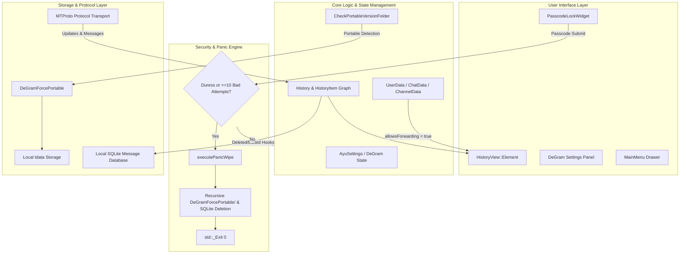

# DeGram Desktop — Technical Architecture

This document provides deep technical details on the C++ subsystems, MTProto protocol hooks, local database persistence, portable directory resolution, and emergency wipe routines in **DeGram Desktop**.

---

## 1. Subsystem Architecture Overview



---

## 2. Portable Directory Resolution Engine

### Detection Logic (`Telegram/SourceFiles/core/launcher.cpp`)
On application startup, `Launcher::CheckPortableVersionFolder()` checks whether portable operation is requested or detected:

```cpp
void Launcher::CheckPortableVersionFolder(const QString &basePath) {
    const auto portable = basePath + u"DeGramForcePortable"_q;
    const auto legacyKangram = basePath + u"KangramForcePortable"_q;
    const auto legacyTelegram = basePath + u"TelegramForcePortable"_q;
    const auto legacyTdata = basePath + u"tdata"_q;
    const auto flagFile = basePath + u"portable"_q;

    if (QDir(portable).exists() || QFile::exists(flagFile)
        || QDir(legacyKangram).exists()
        || QDir(legacyTelegram).exists()
        || QDir(legacyTdata).exists()) {
        cForceWorkingDir(portable);
    }
}
```

On **macOS**, `Contents/Resources/DeGramForcePortable` and bundle directory sibling markers are inspected, ensuring self-contained application operation.

---

## 3. Anti-Recall & SQLite Storage Engine

### Problem in Official Telegram Desktop
Official Telegram Desktop streams messages as in-memory `HistoryItem` pointers. When a peer deletes a message, an MTProto `UpdateDeleteMessages` or `UpdateDeleteChannelMessages` update is received, causing `History::applyMessageUpdate()` to destroy the `HistoryItem` and clear it from memory.

### DeGram Solution
1. **SQLite Storage Backend** (`Telegram/SourceFiles/ayu/data/ayu_database.cpp`):
   - Maintains a local SQLite database (`ayu_database.db` with WAL mode enabled).
   - Tables: `messages` (id, peer_id, date, sender_id, text, media_type, is_deleted, edit_history_json).
2. **Deletion Hook**:
   - In `History::applyMessageUpdate()`: When a delete packet is received, if `saveDeletedMessages` is enabled, the item is tagged with `ItemFlag::IsLocallyDeleted` instead of being destroyed.
   - The message view renders a red trash icon or customizable deletion mark (`deletedMark`).
3. **Edit History**:
   - Every revision of an edited message is captured before the update overwrites the current text, allowing users to view the complete edit diff.

---

## 4. Panic & Duress Subsystem ("KABOOM" Engine)

### Trigger Conditions:
1. **Explicit Duress PIN**: User enters the secondary Duress Passcode configured in DeGram Settings.
2. **Exceeded Bad Tries**: Attacker enters wrong passcodes 10 consecutive times on the lock screen.
3. **Manual Trigger**: "Execute Panic Wipe Now" button in DeGram Security Settings.

### Execution Routine (`AyuSettings::executePanicWipe()`):
```cpp
void AyuSettings::executePanicWipe() {
    const auto working = cWorkingDir();

    // 1. Recursive wipe of all session and encryption key files
    const auto tdata = working + u"tdata"_q;
    QDir(tdata).removeRecursively();

    // 2. Eradicate portable folders if present
    const auto degramPortable = working + u"DeGramForcePortable"_q;
    QDir(degramPortable).removeRecursively();

    const auto telegramPortable = working + u"TelegramForcePortable"_q;
    QDir(telegramPortable).removeRecursively();

    // 3. Eradicate SQLite anti-recall databases and write-ahead logs
    for (const auto &base : { u"ayu_database.db"_q, u"ayudata.db"_q }) {
        const auto dbPath = working + base;
        QFile::remove(dbPath);
        QFile::remove(dbPath + u"-wal"_q);
        QFile::remove(dbPath + u"-shm"_q);
    }

    // 4. Immediate ungraceful exit (prevents flushing in-memory cache to disk)
    std::_Exit(0);
}
```

---

## 5. Restriction Bypass Architecture

### 1. `noforwards` & Protected Media Bypass
* `ChannelData::allowsForwarding()`: Unconditionally returns `true`.
* `ChatData::allowsForwarding()`: Unconditionally returns `true`.
* `UserData::allowsForwarding()`: Unconditionally returns `true`.
* `Story::forbidsForward()`: Unconditionally returns `false`.
* `HistoryItem::forbidsForward()`: Unconditionally returns `false`.

### 2. Disappearing / TTL Media Preservation
* Self-destruction countdowns in `Media::View::OverlayWidget` and `HistoryItem` are bypassed.
* Destructive read receipts (`messages.readMessageContents`) are suppressed until the user explicitly saves or dismisses the media.

---

## 6. Ghost Mode Protocol Suppression

| Protocol RPC | Default Behavior | DeGram Ghost Mode Behavior |
| :--- | :--- | :--- |
| `messages.readHistory` | Sent automatically when viewport scrolls over message | **Blocked** (Message remains unread for sender; manual read action available) |
| `messages.setTyping` | Sent continuously when typing | **Blocked** (Sender sees no typing indicator) |
| `account.updateStatus` | Sent when app is active | **Blocked / Masked** (User appears offline) |
| `stories.readStories` | Sent when viewing a story | **Blocked** (Anonymous story viewing) |

---

## 7. Credits & Lineage

* **Upstream**: [Telegram Desktop](https://github.com/telegramdesktop/tdesktop) and [Desktop App Toolkit](https://github.com/desktop-app)
* **Feature Lineage & Inspiration**: [Telegraher](https://github.com/nikitasius/Telegraher) by Nikita S. ([@nikitasius](https://github.com/nikitasius))
  * **KABOOM Protocol**: Duress PIN shred routine and 10-fail lockscreen trigger
  * **TTL Media Preservation**: Disabling self-destruction on view-once media
  * **Restriction Bypass**: Client-side `noforwards` and `restrict_saving_content` overrides
  * **Multi-Account Scale**: Expanding concurrent account capacity to 100
  * **Ad Filtering**: Dropping server sponsored messages

