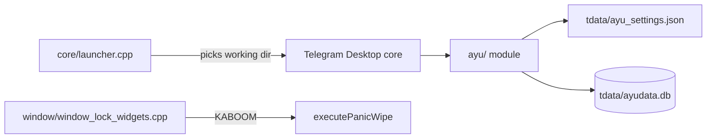

# Architecture

How the DeGram-specific parts work. Paths are relative to `Telegram/SourceFiles/` unless noted. For build and usage, see the [README](../README.md); for the fork map, see [PROJECT_CONTEXT.md](../PROJECT_CONTEXT.md).

## Overview

DeGram is Telegram Desktop plus AyuGram's `ayu/` module, with a few DeGram changes in `core/`, `window/` and `data/`. There is no separate process or plugin layer: everything runs inside the normal client.

## Portable resolution

`CheckPortableVersionFolder()` in `core/launcher.cpp` runs at startup. First match wins:

1. `<exeDir>/DeGramForcePortable`
2. `<exeDir>/TelegramForcePortable`
3. `<exeDir>` itself, if it contains `tdata/` or a file named `portable`
4. macOS only: `DeGram.app/Contents/Resources/{DeGram,Telegram}ForcePortable`

If none match, the normal per-user directory is used. The process current directory is then set to the working directory (`QDir::setCurrent` in `logs.cpp`). This matters because the message database path is relative (below). Kangram support was removed.

## Message history storage

- Database: `tdata/ayudata.db`, SQLite through `sqlite_orm` (`ayu/libs/sqlite/`). The path `./tdata/ayudata.db` is relative to the current directory (`ayu/data/ayu_database.cpp`). There is no file called `ayu_database.db`.
- API: `ayu/data/messages_storage.{h,cpp}` takes `HistoryItem` objects (`addDeletedMessage`, `addEditedMessage`, `getDeletedMessages`, `getEditedMessages`, `clearDeletedMessages`) and calls the lower-level functions in `ayu/data/ayu_database.{h,cpp}`.
- UI: `ayu/ui/message_history/history_inner.cpp` reads the stored messages when you open the deleted/edit history views. `ayu/ui/context_menu/context_menu.cpp` has the related menu items.
- Settings: `tdata/ayu_settings.json`, JSON, class `AyuSettings` in `ayu/ayu_settings.{h,cpp}`. `saveDeletedMessages` is one of its flags.
- Regex filters are stored in the same database (`ayu/features/filters/`).

## Restriction bypass

Servers mark protected chats and messages with `noforwards`. DeGram handles this in three places:

1. **Flag mapping.** The server flag is mapped to a separate `AyuNoForwards` message flag in `history/history_item_helpers.cpp` and `data/data_session.cpp`. `HistoryItem::isAyuNoForwards()` (`history/history_item.cpp`) reads it, so the original restriction is still known.
2. **Native checks return "allowed".** `allowsForwarding()` returns `true` in `data/data_channel.cpp`, `data/data_chat.cpp` and `data/data_user.cpp`. `Story::forbidsForward()` and `HistoryItem::forbidsForward()` return `false`.
3. **Re-send instead of forward.** For protected messages, `ayu/features/forward/ayu_forward.cpp` sends a new message with the same content instead of using Telegram's native forward. `isAyuForwardNeeded()` decides when; the context menu in `history/view/history_view_context_menu.cpp` calls it.

## KABOOM

Entry point: `PasscodeLockWidget::submit()` in `window/window_lock_widgets.cpp`.

- If `AyuSettings::isDuressPasscode(text)` is true (the typed text, after trimming, hashes to the stored `duressPasscodeHash` with `duressPasscodeSalt`; false if none is set), it calls `executePanicWipe()`.
- On a wrong passcode it increments `cPasscodeBadTries`, then calls `executePanicWipe()` if `AyuSettings::shouldPanicOnBadTries(tries)` is true (`kaboomPinFails > 0` and `tries >= kaboomPinFails`). The default is 10 and it is on by default.
- `executePanicWipe()` (`ayu/ayu_settings.cpp`) overwrites every file in `tdata` with zeros (skipping symlinks and `user_data*/`, `emoji/`, `dictionaries/`; the media cache is encrypted with keys that are zeroed), runs `QDir(cWorkingDir() + "tdata").removeRecursively()` and then `std::_Exit(0)`.

Duress passcode storage: `duressPasscodeHash` (PBKDF2-SHA512, 100000 iterations, base64) and `duressPasscodeSalt` (32 random bytes, base64) in `ayu_settings.json`. A legacy plain `duressPasscode` key is migrated to the hash on load and removed. A short numeric PIN can still be brute-forced offline from the hash.

In-app editor: `KaboomBox` in `ayu/ui/settings/settings_ayu.cpp`, opened from the "Duress Passcode / KABOOM Wipe" row (Settings > DeGram Preferences > DeGram). It sets the number of wrong passcodes before wipe (0 = off, max 100, default 10, on by default) and the duress passcode (empty field keeps the current one; "Remove duress" clears it). A duress passcode equal to the local passcode is rejected. The row shows "Wipe after N bad tries" or "Bad tries wipe off", plus ", duress passcode set". The box and "Kill the App" strings are `degram_*` keys in `Telegram/Resources/langs/lang.strings`.

Limits: the overwrite is best effort. SSDs (wear levelling) and copy-on-write or journaling filesystems may keep old copies, so it is not a guaranteed secure erase. On Windows, files that are still open may fail to delete. There is no "Panic Wipe Now" button.

The drawer item "Kill the App" (`window/window_main_menu.cpp`) calls `std::_Exit(0)` directly and does not wipe anything.

## Ghost mode

Settings are per account (`GhostModeAccountSettings` in `ayu/ayu_settings.h`), all off by default:

| Setting | Effect when off | Where it is checked |
| :--- | :--- | :--- |
| `sendReadMessages` | No read receipts | `apiwrap.cpp`, `api/api_views.cpp`, `api/api_polls.cpp`, `ayu/utils/telegram_helpers.cpp` |
| `sendReadStories` | No story views | `window/window_controller.cpp` |
| `sendOnlinePackets` | No online status | `api/api_updates.cpp` |
| `sendUploadProgress` | No typing/upload status | `api/api_send_progress.cpp` |
| `sendOfflinePacketAfterOnline` | Sends offline right after online | `ayu/ayu_worker.cpp` |

The settings UI is in `ayu/ui/settings/settings_ayu.cpp`; the drawer in `window/window_main_menu.cpp` has a quick toggle.

## Other behavior

- Sponsored messages are hidden when `disableAds` is on (default): `data/components/sponsored_messages.cpp`.
- `kMaxAccounts = 100` in `main/main_domain.h`.
- Streamer mode hides windows from screen capture: `ayu/features/streamer_mode/`.
- Crash reporting is off by default.

## Network endpoints

Only Telegram's own servers, plus Google / Yandex translate if selected as the translation provider (`ayu/features/translator/`). `ayu/ayu_lang.{cpp,h}` is removed: AyuGram-specific strings use the built-in English from `lang.strings` in every language. `RCManager` (`ayu/utils/rc_manager.{h,cpp}`) is offline-only: built-in developer and channel lists, no supporter badges, no requests to `update.ayugram.one` or `api.exteragram.app`.

## Credits

- [Telegram Desktop](https://github.com/telegramdesktop/tdesktop): the base client.
- [AyuGram Desktop](https://github.com/AyuGram/AyuGramDesktop) by AlexeyZavar and Radolyn: most of `ayu/`. Source headers there read "This is the source code of AyuGram for Desktop, modified for DeGram."
- [Telegraher](https://github.com/nikitasius/Telegraher) by nikitasius: the ideas behind KABOOM, TTL handling, the restriction bypass, the 100-account limit and ad filtering.
